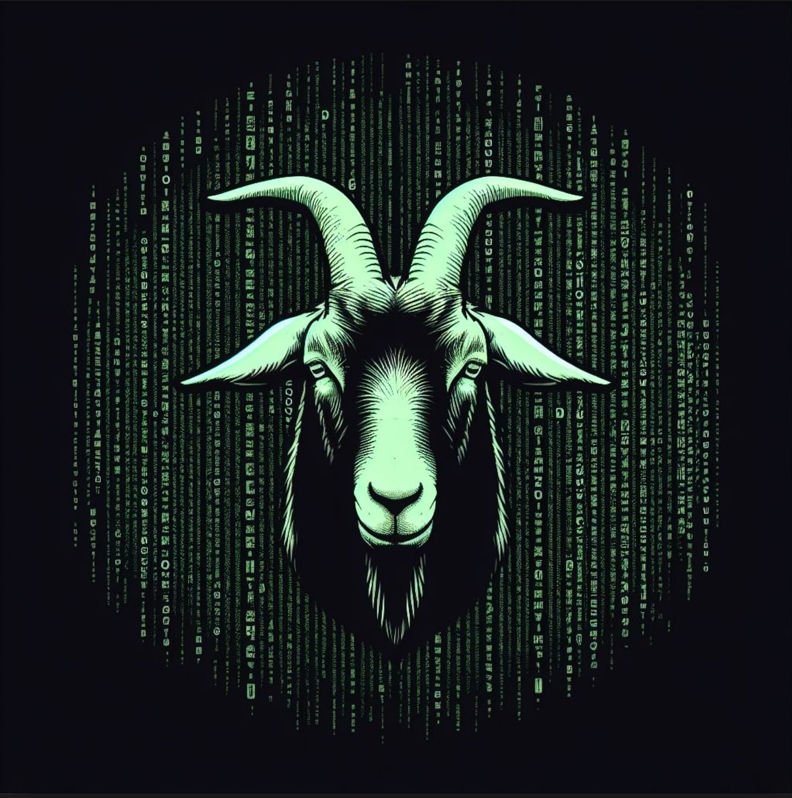

<br />
<p align="center">
  <a href="https://huggingface.co/recogna-nlp/bode-7b-alpaca-pt-br/tree/main"
    
</a>
<!---  -->


# BODE

Bode é um modelo de linguagem (LLM) para o português desenvolvido a partir do modelo Llama 2 por meio de fine-tuning no dataset Alpaca, traduzido para o português pelos autores do [Cabrita](https://huggingface.co/22h/cabrita-lora-v0-1). Este modelo é projetado para tarefas de processamento de linguagem natural em português, como geração de texto, tradução automática, resumo de texto e muito mais.

## Detalhes do Modelo

- **Modelo Base:** Llama 2
- **Dataset de Treinamento:** Alpaca
- **Idioma:** Português

## Versões disponíveis

| Quantidade de parâmetros       | Modelo                                                                                      | 
| :-:                            | :-:                                                                                         | 
| 7b                             |[recogna-nlp/bode-7b-alpaca-pt-br](https://huggingface.co/recogna-nlp/bode-7b-alpaca-pt-br)  |
| 13b                            |[recogna-nlp/bode-13b-alpaca-pt-br](https://huggingface.co/recogna-nlp/bode-13b-alpaca-pt-br)|

## Uso

Você pode usar o Bode facilmente com a biblioteca Transformers do HuggingFace. Aqui está um exemplo simples de como carregar o modelo e gerar texto:

```python
from transformers import AutoModelForCausalLM, AutoTokenizer, GenerationConfig
from peft import PeftModel, PeftConfig

llm_model = 'recogna-nlp/bode-7b-alpaca-pt-br'
config = PeftConfig.from_pretrained(llm_model)
model = AutoModelForCausalLM.from_pretrained(config.base_model_name_or_path, trust_remote_code=True, return_dict=True, load_in_8bit=True, device_map='auto')
tokenizer = AutoTokenizer.from_pretrained(config.base_model_name_or_path)
model = PeftModel.from_pretrained(model, llm_model)
model.eval()

#Testando geração de texto

def generate_prompt(instruction, input=None):
    if input:
        return f"""Abaixo está uma instrução que descreve uma tarefa, juntamente com uma entrada que fornece mais contexto. Escreva uma resposta que complete adequadamente o pedido.

### Instrução:
{instruction}

### Entrada:
{input}

### Resposta:"""
    else:
        return f"""Abaixo está uma instrução que descreve uma tarefa. Escreva uma resposta que complete adequadamente o pedido.

### Instrução:
{instruction}

### Resposta:"""
     
generation_config = GenerationConfig(
    temperature=0.2,
    top_p=0.75,
    num_beams=4,
)

def evaluate(instruction, input=None):
    prompt = generate_prompt(instruction, input)
    inputs = tokenizer(prompt, return_tensors="pt")
    input_ids = inputs["input_ids"].cuda()
    generation_output = model.generate(
        input_ids=input_ids,
        generation_config=generation_config,
        return_dict_in_generate=True,
        output_scores=True,
        max_new_tokens=256
    )
    for s in generation_output.sequences:
        output = tokenizer.decode(s)
        print("Resposta:", output.split("### Resposta:")[1].strip())

evaluate("Responda com detalhes: O que é um bode?")
#Exemplo de resposta obtida (pode variar devido a temperatura): Um bode é um animal do gênero Bubalus, da família Bovidae, que é um membro da ordem Artiodactyla. Os bodes são mamíferos herbívoros que são nativos da Ásia, África e Europa. Eles são conhecidos por seus cornos, que podem ser usados para defesa e como uma ferramenta.
```

## Treinamento e Dados

O modelo Bode foi treinado por fine-tuning a partir do modelo Llama 2 usando o dataset Alpaca em português. O treinamento foi realizado no Supercomputador Santos Dumont do LNCC, através do projeto da Fundunesp em parceria com a Petrobras: 2019/00697-8 - ProtoRADIAR: Métodos de Captura e Disseminação do Conhecimento, através de Processamento de Linguagem Natural na Área de Poços. O uso do Santos Dumont possibilitou o treinamento de modelos maiores, como o LLaMa2-13b.

## Contribuições

Contribuições para a melhoria deste modelo são bem-vindas. Sinta-se à vontade para abrir problemas e solicitações pull.

## Contato

Para perguntas, sugestões ou colaborações, entre em contato com [recogna-nlp@gmail.com].

## Citação

Se você usar o modelo de linguagem Bode em sua pesquisa ou projeto, por favor, cite-o da seguinte maneira:

```
    @misc{bode_2023,
        author       = { GARCIA, Gabriel Lino and PAIOLA, Pedro Henrique and  MORELLI, Luis Henrique and CANDIDO, Giovani and CANDIDO JUNIOR, Arnaldo and GUILHERME, Ivan Rizzo and PAPA, João Paulo and PENTEADO, Bruno Elias},
        title        = { {BODE} },
        year         = 2023,
        url          = { https://huggingface.co/recogna-nlp/bode-7b-alpaca-pt-br },
        doi          = { xxx },
        publisher    = { Hugging Face }
    }
```